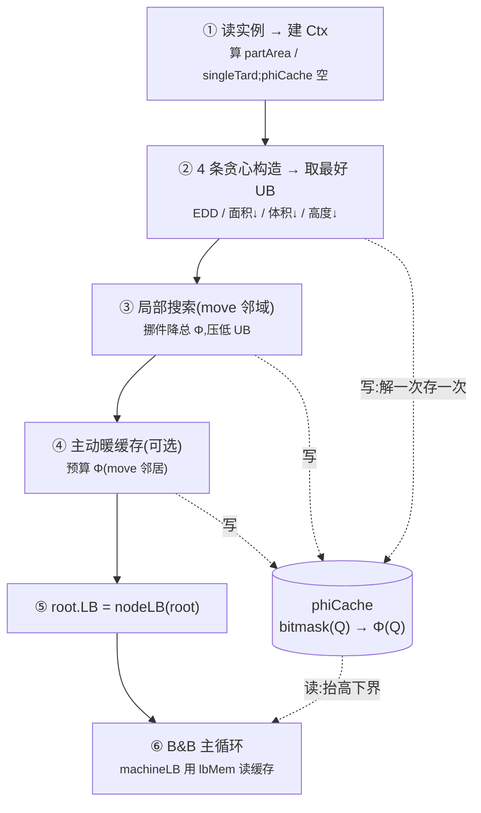

# 并行机 B&B:初始化 与 暖缓存(技术细节)

本文讲清楚 `src/ParallelBranchBound.cpp` 在进入分支定界主循环**之前**做的事——构造初始上界、局部搜索、
以及"暖缓存"——以及它们为什么能加速搜索。配套实验数据见末尾。

> 一句话:**任何 Φ 调用都把结果存进 `phiCache`;B&B 每个节点的下界 `lbMem` 又从 `phiCache` 里读。
> 所以"开搜索前多算几个有用的 Φ"= 暖缓存 = 间接抬高了下界。** 这条路绕开了"自由零件下界"那堵墙
> (见 `Parallel_BnB_Improvements.md`)。

---

## 流程图



- **实线** = 控制流;**虚线** = 缓存读/写。
- ②③④ 都会调用 Φ → 往 `phiCache` 写;⑥ 的每个节点下界 `lbMem` 从 `phiCache` 读。
- ④ 是可选的"显式暖缓存";因为 ③ 局搜评估 move 时已经在写这些 Φ,④ 在 ③ 之上**基本冗余**(见数据)。

---

## 模块伪代码

### ① Φ(Q) —— 带缓存的单机 oracle 包装(唯一写缓存的地方)

```text
function Phi(Q):                       # Q = 分到某台机器的零件集合
    key = bitmask(Q)                   # 位掩码当哈希键
    if key in phiCache:                # 命中
        oracle_cache_hits += 1
        return phiCache[key]
    val = solvePhi(Q)                  # 未命中:跑强单机 oracle(new_oracle/phi_oracle.h)
    oracle_calls += 1
    phiCache[key] = val                # 存进记忆池
    return val
```

### ② 缓存怎么被"读"来抬下界

```text
function lbMem(Q):                      # 用缓存给机器集 Q 一个下界
    best = 0
    for (C, phiC) in phiCache:          # 扫所有已缓存子集
        if C ⊆ Q:                       # 由 Φ 单调性,phiC ≤ Φ(Q),合法
            best = max(best, phiC)
    return best

function machineLB(Q):                  # 一台机器的下界
    return max( lbPar(Q), lbPos(Q), lbMem(Q) )

function nodeLB(node):                  # 节点总下界(已分 + 自由,两块不相交)
    return Σ_m machineLB(已分_m) + Σ_{自由 j} singleTard[j]
```

> **关键**:`lbMem(Q)` 只有在"缓存里有一个大且 Φ 高的 `C⊆Q`"时才强 —— 这正是暖缓存为什么能抬下界。
> 特别地,若缓存里**恰好有 Φ(Q) 本身**,则 `lbMem(Q)=Φ(Q)` = 该机器最紧的界。

### ③+④ 初始上界 + 暖缓存(`buildInitialIncumbent`)

```text
function buildInitialIncumbent():
    # --- 4 条贪心构造,取最好 ---
    UB = +inf
    for rule in [EDD, 面积↓, 体积↓, 高度↓]:
        Aa  = constructByOrder(rule)               # 按规则贪心装配
        val = Σ_m Phi(Aa[m])                       # 各机器调 Φ(顺带暖缓存)
        if val < UB: UB, best = val, Aa

    # --- 局部搜索:move 邻域,降总 Φ(只会降低 UB,正确性安全)---
    repeat until 无改进 or 超时:
        for each 机器 m, 每个件 j ∈ Aa[m]:
            for each 其他机器 m':
                Δ = (Phi(Aa[m]\{j}) + Phi(Aa[m']∪{j}))   # ← 这些 Φ 都进缓存
                  - (Phi(Aa[m])     + Phi(Aa[m']))
                if Δ < 0: 把 j 从 m 挪到 m'; 记一次改进; break
    val = Σ_m Phi(Aa[m]); if val < UB: UB, best = val, Aa

    # --- (可选)主动暖缓存:专门预算"搜索会访问的配置" ---
    if WARM:
        for each 机器 m:
            Q = best[m]
            Phi(Q)                                  # 整组
            for x in Q: Phi(Q \ {x})                # drop-1 子集(用处不大)
            for j ∉ Q (在别的机器上): Phi(Q ∪ {j})   # ★ move 邻居 = 真正有用的那批
    return UB, best
```

### 顶层装配(`solveParallelMachine`)

```text
build Ctx (partArea, singleTard, 空 phiCache)
UB, best = buildInitialIncumbent()      # ②③④ 都在这,缓存已被暖
root.LB  = nodeLB(root)                  # ⑤
push root into active
while active 非空:                       # ⑥ B&B 主循环
    取一个节点 → 若 LB ≥ UB 则剪
    叶子: Z = Σ_m Phi(机器集); 若 Z < UB 更新 UB(incumbent)
    否则: 选分支零件 j; 对每台候选机器 r 生成子节点;
          child.LB = nodeLB(...)         # 内部 machineLB 调 lbMem,从缓存取界
```

---

## 为什么"暖 move 邻居"才有效(而暖子集没用)

B&B 在指派分支时,访问的机器集形如 **"某机器的已分件 + 一个外来件"**(`Q_m ∪ {j}`)。
- 暖**子集**(`Q_m \ {x}`):虽然 `⊆` 搜索节点的 Q,但 Φ 更小(单调)→ witness 弱 → 几乎不抬界。
- 暖**move 邻居**(`Q_m ∪ {外来 j}`):正是搜索会落到的那个 Q,缓存里有它 → `lbMem(Q)=Φ(Q)` 直接取到最紧界。

实测(14part, M=3, 最优 14.907,目标值全程不变):

| 配置 | 生成节点 |
|---|---|
| 基线(无局搜、无暖) | 91026 |
| 仅暖"增量集 + drop-1 子集" | 90723(≈没用) |
| **仅暖 move 邻居** | **15378** |
| 仅局部搜索 | 15378 |

→ **单暖 move 邻居,一项就复刻了局搜 83% 的节点削减**(此例局搜并未降低 UB,全靠暖缓存抬下界)。

---

## 两条机制此消彼长(局搜的真实收益拆解)

局部搜索的加速 = ① 压紧 UB + ② 顺带暖 move 邻居缓存抬 lbMem。占比随实例变化:

| 实例 | M | 局搜降 UB? | 纯暖缓存能省 | 局搜能省 | 主因 |
|---|---|---|---|---|---|
| 14part | 3 | 否(16.89→16.89) | **83%** | 83% | 全是 ② 暖缓存 |
| 13part | 4 | 是(24.67→19.87=最优) | 5% | 86% | 全是 ① 压 UB |
| 15part | 3 | 是(14.22→13.19=最优) | 部分 | 52% | ①② 都有 |

> 注:**正确性永远不受影响**——暖缓存只往池里加合法下界 witness,局搜只会降低 UB。所有最优值/指派与改动前完全一致。

---

## 开关(env,默认即最优配置)

| 变量 | 默认 | 含义 |
|---|---|---|
| `LS` | 1 | 局部搜索(move 邻域)开/关 |
| `WARM` | 0 | 显式暖缓存开/关(已扩到 move 邻居);在 LS 开时基本冗余 |
| `WARMDEPTH` | 1 | 暖子集深度(1=drop-1,2=drop-2) |
| `UBSEED` | — | 诊断用:直接注入一个上界(测"完美 UB 能省多少") |
| `FREEPAR` | 0 | 并行位置自由零件界(已证被 singleTard 压制,默认关) |

复现:`cd src && g++ -std=c++17 -O2 -o pbb main.cpp ParallelBranchBound.cpp BranchBound.cpp InstanceData.cpp`,
`./pbb ../data/14part.txt 3 200`(Φ 由 `../new_oracle/phi_oracle.h` 提供)。
